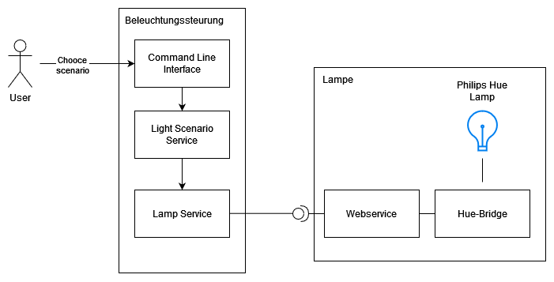
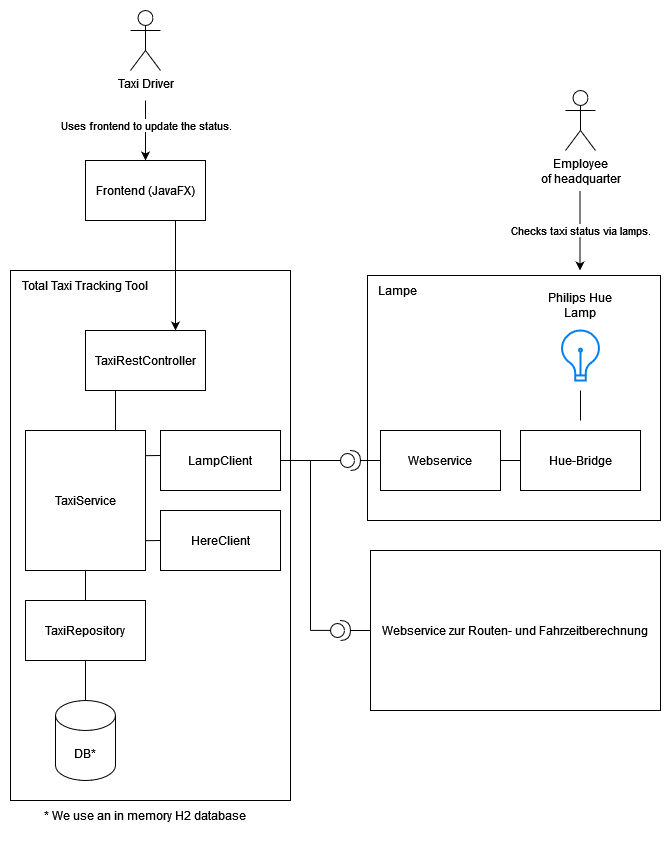
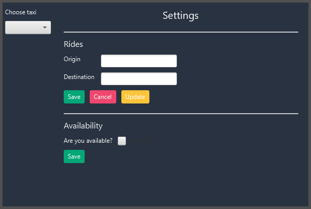

# Übung 4: Webservices mit REST

## Gruppe
Mitglieder: Vincenzo Auricchio und Tim Kammerlocher

## Inhalt
- Aufgabe 4.2 Beleuchtungssteuerung
- Aufgabe 4.3 Taxi Service

## Aufgabe 4.2: Beleuchtungssteuerung

### Sinn der Software
Die Software soll gemäß unseren Wünschen unterschiedliche Beleuchtungsszenarien einstellen können. Die Beleuchtung wird über die "Philips Hue"-Lampen realisiert (siehe Angabe).

### Verwendete Technologien
Um die Software zu starten bzw. weiterzuentwicklen werden die folgenden Technologien benötigt:
- OpenJDK 11
- Maven

### Philips Hue Lampen
Die Lampen stehen physikalisch in den Laboren der Hochschule München und können über die Philips Hue API angesprochen werden. Mit dieser wird auf einen Webservice zugegriffen, der von der Hue-Bridge zur Verfügung gestellt wird. Die Bridge steuert dann wiederum die Lampen über eine drahtlose Zigbee-Verbindung, ein typischer Ansatz aus dem Bereich Internet-of-Things (IoT). Für weitere Information siehe Angabe.

### Architektur

Das Command Line Interface (CLI) stellt dem Benutzer eine Auswahl an Beleuchtungsszenarien zur Auswahl und der Benutzer wählt eines aus. Das CLI verwendet den Light Scenario Service, der die von uns bestimmten Beleuchtungsszenarien implementiert. Dabei greift er auf die Methoden des Lamp Service zurück, der mit dem Webservice der Hue-Bridge kommuniziert.

### Starten der Applikation auf dem Rechner
Führe die `main`-Methode in der `edu.hm.network.group12.Application` Klasse aus deiner IDE heraus aus.

### Postman collection
Dem Projekt ist eine Postman Kollektion beigefügt, mit dem die Philips Hue API werden kann.

## Aufgabe 4.3: Total Taxi Tracking Tool (T4)

### Sinn der Software
Die Software dient zum Monitoring der Fahrten eines einzelnen Taxiunternehmens. Aktuell sind in dem Unternehmen drei Taxis (bzw. Taxifahrer:innen) unter
Vertrag. Der Status dieser drei Taxis soll in der Zentrale über drei in unterschiedlichen
Farben ansteuerbare Lampen (Philips Hue-Lampen) überwacht werden. Jedes Taxi kann sich
dabei in vier unterschiedlichen Zuständen befinden, der entsprechende Zustand wird durch
die entsprechende Lampe in der Zentrale visualisiert. Die Zustände und das entsprechende Lampenverhalten kann der folgenden Tabelle entnommen werden.

| Zustand des Fahrzeugs      									| Lampenverhalten 			|
| ------------------------------------------------------------- | ------------------------- |
| Fahrer:in hat Pause/ist inaktiv								| Lampe ist ausgeschaltet   |
| Fahrer:in hat aktuell keinen Fahrgast/Taxi ist frei   		| Lampe leuchtet grün  		|
| Fahrer:in hat Fahrgast und wird Ziel rechtzeitig erreichen    | Lampe leuchtet gelb       |
| Fahrer:in hat Fahrgast und wird Ziel zu spät erreichen    	| Lampe blinkt rot       	|

### Verwendete Technologien
Um die Software zu starten bzw. weiterzuentwicklen werden die folgenden Technologien benötigt:
- OpenJDK 11
- Maven
- Spring Boot 2.4.0

### REST-Api zur Routen- und Fahrzeitberechnung
Wir nutzen die kostenlose REST-Api von https://platform.here.com/ für die Berechnung der Routen- sowie Fahrzeit.

### Datenbank
Um die Daten "zu speichern", verwenden zu Beginn die inmemory Datenbank H2. Sobald der Service beendet wird, gehen die Daten somit verloren. Wir haben uns für eine inmemory Datenbank entschieden, um den komplexen Konfigurationsaufwand zu umgehen und die Software einfach starten zu können auf den Laborrechnern. Damit müssen wir uns keine Sorgen machen über eine vorhandene Installation der benötigten Software.

### Überwachung eines Taxi Status
Im Rahmen der Aufgabe müssen wir überprüfen, wann ein Taxi den gewünschten Zielort des Passagieres erreicht. Hierfür greifen wir auf die Dauer in Sekunden zurück, die das Taxi benötigt, um von der Start- bis zur Zieladresse zu gelangen. Wir müssen parallel überprüfen können, wann diese Dauer vorbei ist. Hierfür verwenden wir ein Open-Source Framework Quartz, dass uns bei der Bewältigung dieser Aufgabe hilft. Für weitere Informationen siehe `https://www.baeldung.com/spring-quartz-schedule`.

### Architektur

Der "Total Taxi Tracking Tool" (T4) Service stellt eine REST-Api bereit über den TaxiRestController. Dieser verwendet den Taxi Service, um Taxidaten zu bearbeiten nach dem CRUD-Prinzip (Create, Read, Update und Delete). 

Der Taxi Service verwendet den Lamp Client um den aktuellen Fahrzeugzustand visuell darzustellen durch die Philips Hue Lamp. Außerdem benutzt der Taxi Service den Here Client, welcher mit der REST-Api der Here Platform kommuniziert für Routen- und Fahrzeitdaten.

Für die Speicherung der Daten wird das Taxi Repository verwendet, welches die Daten in eine inmemory H2 Datenbank schreibt. Die Daten gehen verloren, sobald der T4 Servie gestoppt wird.

### Frontend
Ein Taxifahrer kann über unser T4-Frontend seine Verfügbarkeit aktualisieren bzw. eine Fahrterstellen und ggf. abbrechen. Um das Frontend zu implementieren haben wir uns für JavaFX entschieden. Das Frontend kann als eigenständige Applikation laufen.

### Starten der Applikation auf dem Rechner
Führe die `main`-Methode in der `edu.hm.network.group12.Application` Klasse aus deiner IDE heraus aus.

### SwaggerUI
Als API-Dokumentation verwenden wir eine SwaggerUI. Diese kann über `http://localhost:8080/swagger-ui/index.html` aufgerufen werden, wenn der Service lokal läuft.

### Postman Kollektion
Als zusätzliche Möglichkeit unsere API anzusprechen, findet sich im Total-Tracking-Taxi-Tool eine Postman Kollektion, die via Postman importiert werden kann.

## Lizenz
Die gesamte Aufgabe entstammt aus der Vorlesung Netzwerke I an der Hochschule München aus dem Wintersemester 2022/23. Die Ersteller der Aufgaben sind Herr Prof. Dr. L. Wischhof und Prof. Dr. A. Zugenmaier an der Fakultät 07.

Ich (Vincenzo Auricchio) und Tim Kammerlocher sind nur die Bearbeiter der gestellten Aufgabe.

