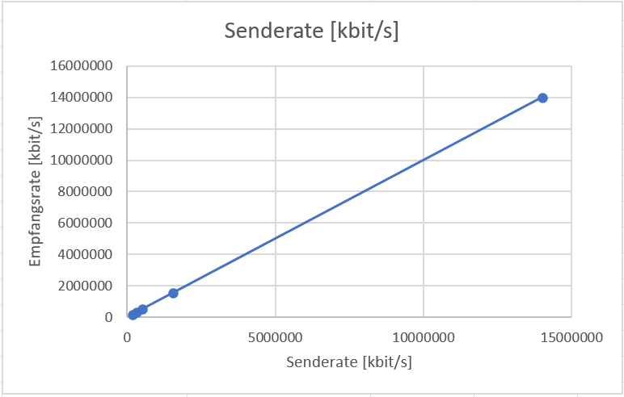
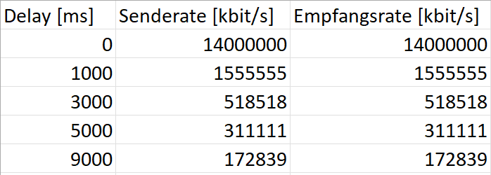
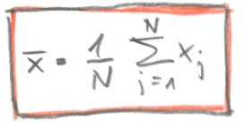
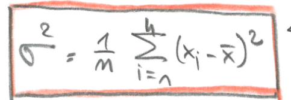
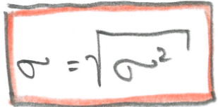
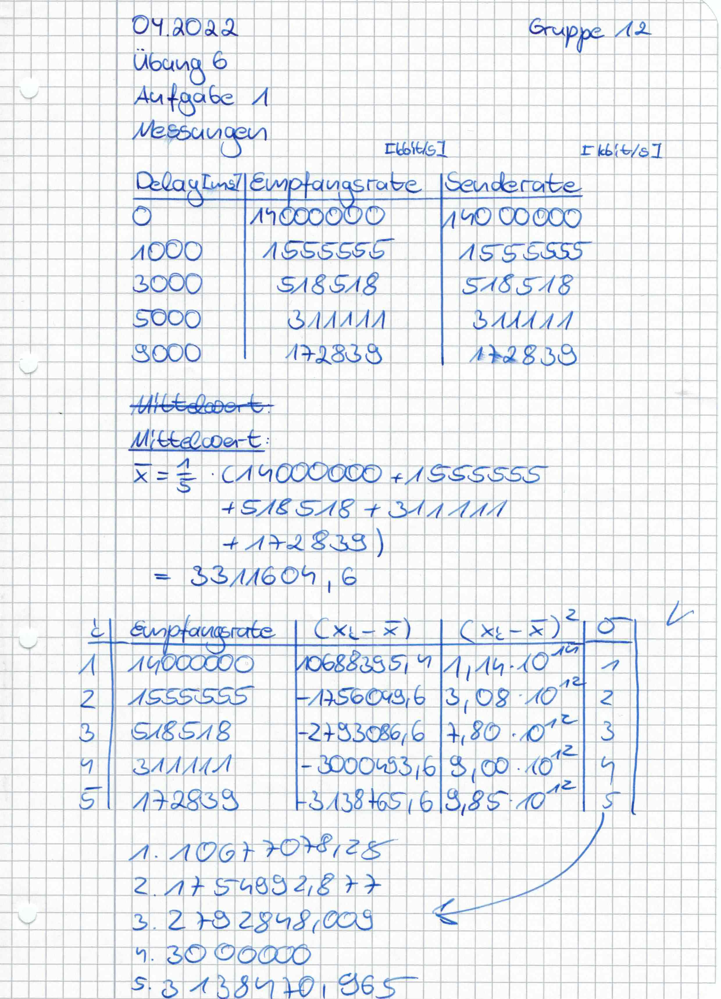

# Übungsblatt 6

## Aufgabe 6.1

### Messungen

#### a)
Auf UDP erhalten wir für beide Verbindungsarten bei gleichem Delay, die selben Werte für Sende- und Empfangsrate.

#### b)
Als Netzwerkteilnehmer verwenden wir den Laptop von Tim sowie meinen PC. Als Sende- und Empfangsraten erhalten wir folgende Werte:

Wir beobachten, dass die Werte ebenfalls wieder die selben sind. Ist das korrekt so? Dies würde bedeuten, dass die Standardabweichung für jeden Versuch, die selbe wäre. (Abklären!)

Für die Standardabweichung würden wir im ersten Schritt den Mittelwert der Datenklassen bilden.

Im nächsten Schritt können wir die Varianz ausrechnen.

Zum Schluss berechnen wir die Standardabweichung.

Anbei unsere Rechnungen exemplarisch für die Standardabweichung. Da alle Messergebnisse in unserem Fall gleich sind, sind die Werte ebenfalls gleich. Das Zustandekommen der gleichen Werte können wir nicht nachvollziehen und würden es gerne bei der Abnahme ggf. besprechen.

Rechnung_Standardabweichung und_varianz

